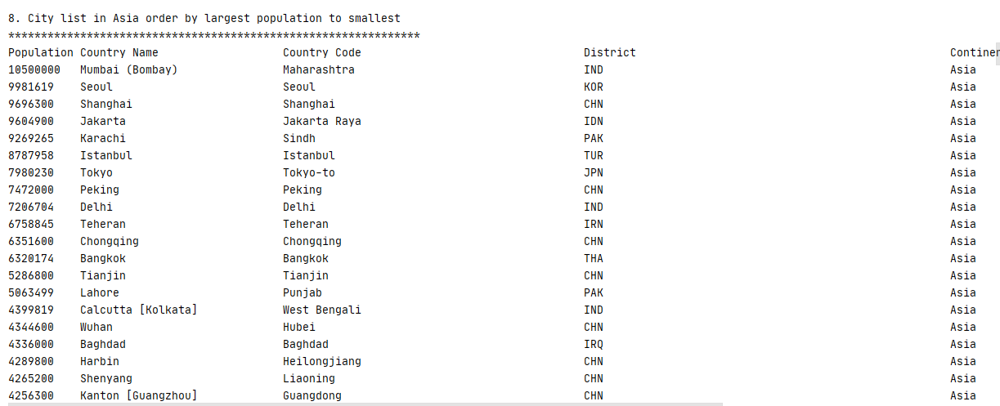
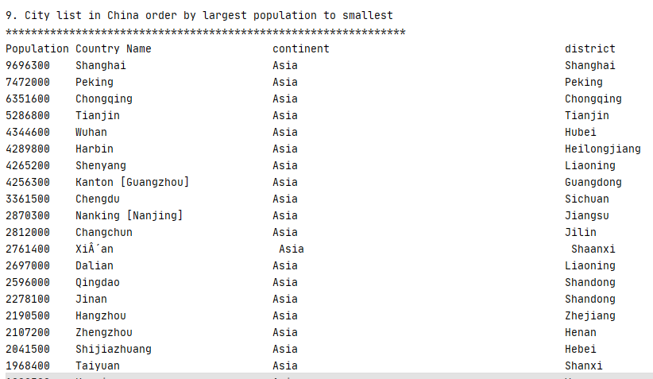
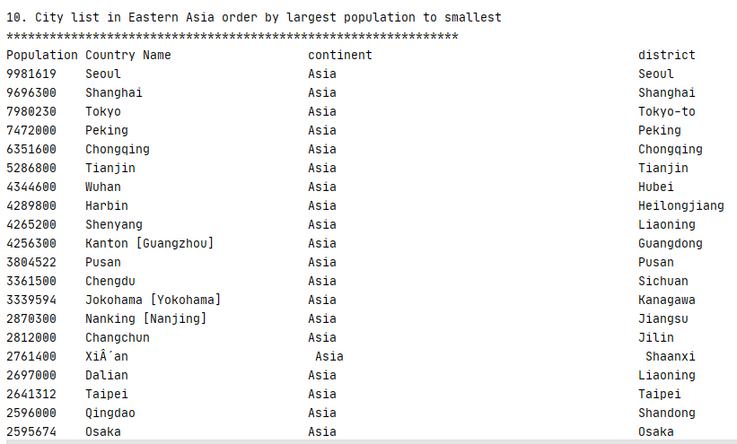
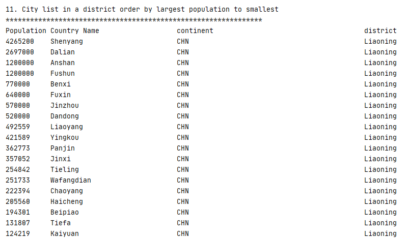
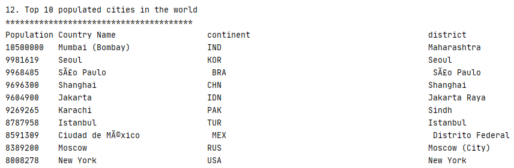

| ID | Name | Met | Screenshot |
| ------- | ----------- | ------- | ----------- |
| 1 | All the countries in the world organised by largest population to smallest. | Yes | 
| 2 | All the countries in a continent organised by largest population to smallest. | Yes | 
| 3 | All the countries in a region organised by largest population to smallest. | Yes | 
| 4 | The top N populated countries in the world where N is provided by the user. | Yes | 
| 5 | The top N populated countries in the continent where N is provided by the user. | Yes | 
| 6 | The top N populated countries in the region where N is provided by the user. | Yes | 
| 7 | All the cities in the world organised by largest population to smallest. | Yes | 
| 8 | All the cities in the continent organised by largest population to smallest. | Yes | 
| 9 | All the cities in the region organised by largest population to smallest. | Yes | 
| 10 | All the cities in the country organised by largest population to smallest. | Yes | 
| 11 | All the cities in the distict organised by largest population to smallest.. | Yes | 
| 12 | The top N populated cities in the world where N is provided by the user. | Yes | 
| 13 | The top N populated cities in the continent where N is provided by the user. | Yes | 
| 14 | The top N populated cities in the region where N is provided by the user. | Yes | 
| 15 | The top N populated cities in the country where N is provided by the user. | Yes | 
| 16 | The top N populated cities in the district where N is provided by the user. | Yes | 
| 17 | All the capital cities in the world organised by largest population to smallest. | Yes | 
| 18 | All the capital cities in the continent organised by largest population to smallest. | Yes | 
| 19 | All the capital cities in the region organised by largest population to smallest. | Yes | 
| 20 | The top N populated capital cities in the world where N is provided by the user. | Yes | 
| 21 | The top N populated capital cities in the continent where N is provided by the user. | Yes | 
| 22 | The top N populated capital cities in the region where N is provided by the user. | Yes | 
| 23 | All population in the World. | Yes | 
| 24 | All population in the Continent. | Yes | 
| 25 | All population in the Region. | Yes | 
| 26 | All population in the Country. | Yes | 
| 27 | All population in the district. | Yes | 
| 28 | All population in the City. | Yes | 
| 29 | Percentage of Using Language in the world. | Yes | 
| 30 | The population of people, people living in cities, and people not living in cities in each country. | Yes | 
| 31 | The population of people, people living in cities, and people not living in cities in each region. | Yes | 
| 32 | The population of people, people living in cities, and people not living in cities in each continent. | Yes | 
