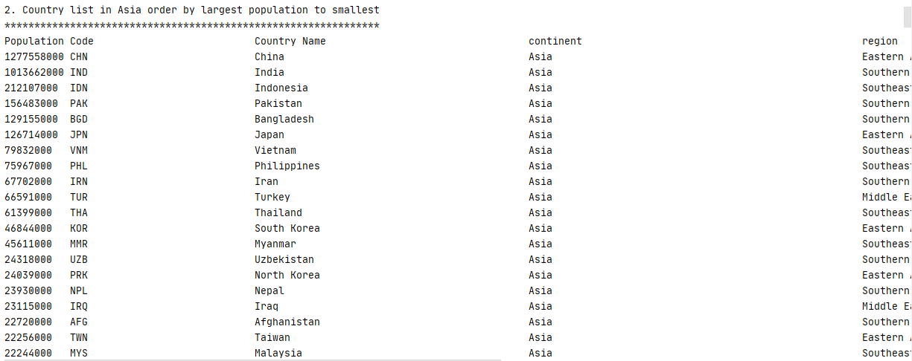
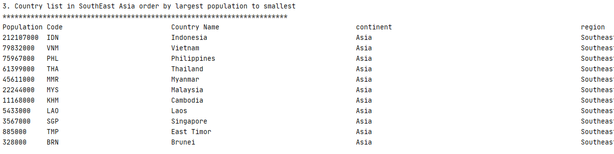
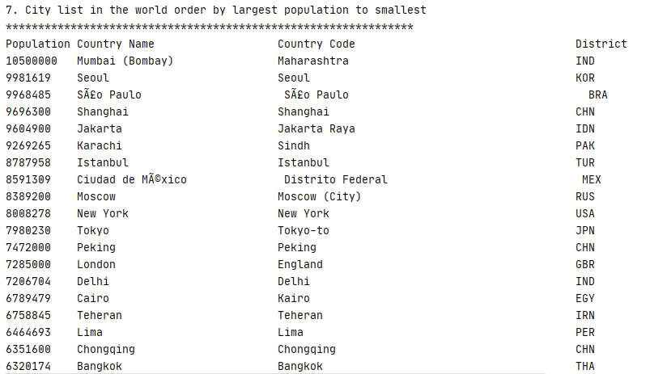
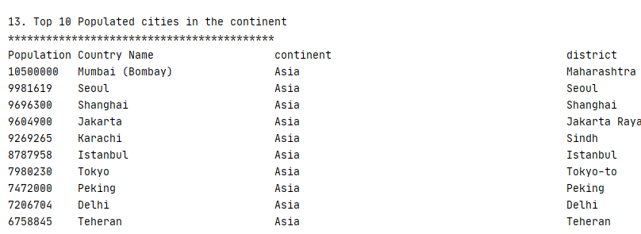
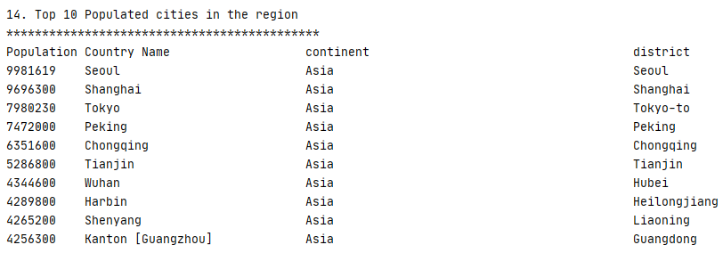
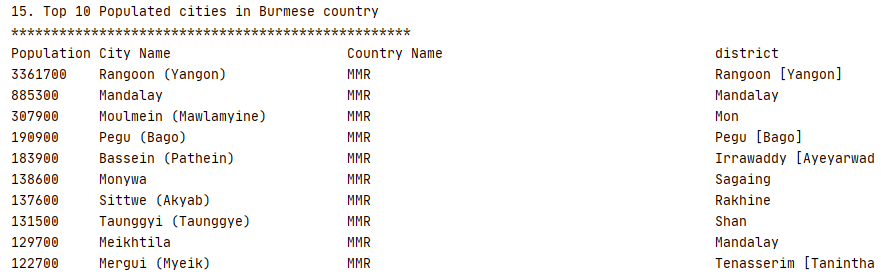
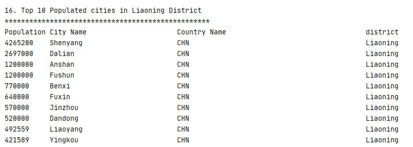

| ID | Name | Met | Screenshot |
| ------- | ----------- | ------- | ----------- |
| 1 | All the countries in the world organised by largest population to smallest. | Yes | 
| 2 | All the countries in a continent organised by largest population to smallest. | Yes | 
| 3 | All the countries in a region organised by largest population to smallest. | Yes | 
| 4 | All the cities in a region organised by largest population to smallest. | Yes | 
| 5 | All the cities in a district organised by largest population to smallest. | Yes | 
| 6 | The top N populated cities in the world where N is provided by the user. | Yes | 
| 7 | The top N populated cities in a continent where N is provided by the user. | Yes | 
| 8 | The top N populated cities in a region where N is provided by the user. | Yes | 
| 9 | The top N populated cities in a country where N is provided by the user. | Yes | 
| 10 | The top N populated cities in a district where N is provided by the user. | Yes | 
| 11 | All the capital cities in the world organised by largest population to smallest. | Yes | 
| 12 | All the capital cities in a region organised by largest to smallest. | Yes | 
| 13 | All the capital cities in a continent organised by largest population to smallest. | Yes | 
| 14 | The top N populated capital cities in the world where N is provided by the user. | Yes | 
| 15 | The top N populated capital cities in a continent where N is provided by the user. | Yes | 
| 16 | The top N populated capital cities in a region where N is provided by the user. | Yes | 
